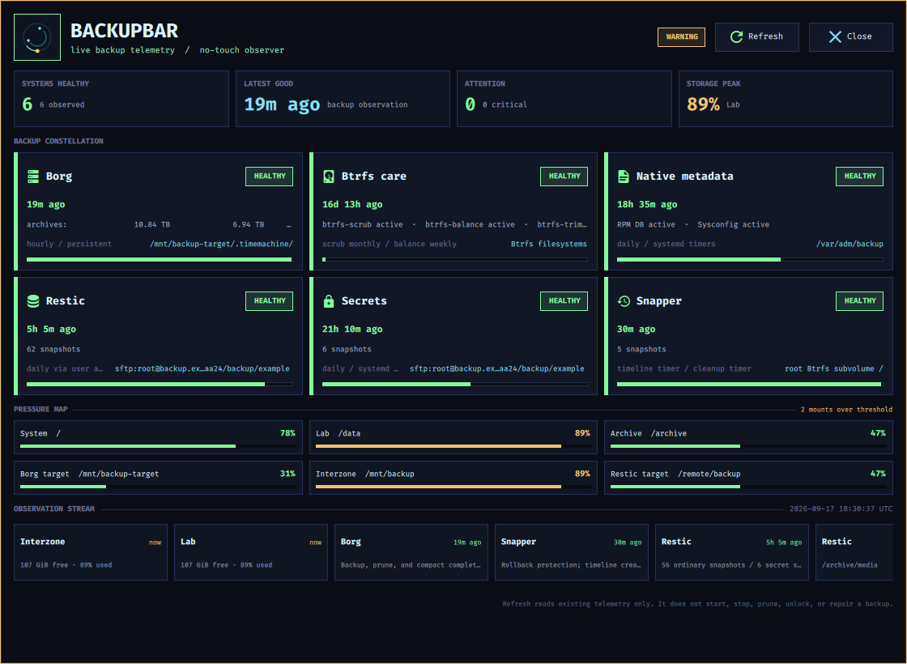

# BackupBar

[](http://vigilance:3002/blackopsrepl/backupbar-sway/actions)

BackupBar is a Linux status surface for backup infrastructure that already exists. It combines bounded, read-only Ruby observation with a terse Waybar chip and a centered QuickShell panel.

It is deliberately no-touch. BackupBar does not start or stop backups, prune repositories, unlock or repair them, remove locks, rotate credentials, or add another scheduler.

<p align="center">
  
</p>



## Opinionated Integration

BackupBar is usable as a standalone observer, but its richest integration is intentionally specific to the author's Linux backup stack. It expects conventions from these public GitHub projects:

- [SolverForge Linux](https://github.com/blackopsrepl/solverforge-linux) supplies the openSUSE + Sway desktop layer, the existing `solverforge-backup` and `solverforge-backup-prune` jobs, the secret-archive timer, and the native metadata backup timers.
- [Borg Time Machine](https://github.com/blackopsrepl/borg-timemachine) supplies the Borg service, configuration, and repository metadata that BackupBar observes.

Restic itself remains the standard upstream tool; BackupBar reads its repository and password-file paths from the existing SolverForge shell configuration and reads cadence from the user's `~/.anacrontab`. On another distribution or with a different backup layout, the core observer still runs, but the default paths, units, schedules, and coverage assumptions must be adapted. This is an integration surface, not a portable backup orchestrator.

## What It Shows

- Borg service and timer state, bounded journal state, and optional repository metadata.
- Restic snapshot freshness, configured paths, existing user anacron cadence, and secret-tagged snapshots.
- Native RPM database and sysconfig backup timers.
- Snapper timeline and cleanup state.
- Btrfs scrub, balance, and trim maintenance state.
- Filesystem pressure for configured mount paths.

The presenter produces view-ready state. Waybar and QuickShell read the cached snapshot; they never call Borg, Restic, systemd, journalctl, or `df` directly. Secrets and passphrase contents never enter runtime JSON, logs, tooltips, or QML.

## Requirements

- Linux with Ruby 3.1 or newer.
- Waybar and QuickShell 0.3 or newer for the desktop surface.
- `qmllint` for development validation.
- The existing backup tools and configuration that you want to observe.
- Fira Code and Symbols Nerd Font Mono for the supplied Hackerman-style UI.

BackupBar does not install or configure backup infrastructure. It reads the existing SolverForge Linux configuration, including the user anacron file at `~/.anacrontab`.

## Install

Clone the public Forgejo repository:

```bash
git clone http://vigilance:3002/blackopsrepl/backupbar-sway.git
cd backupbar-sway
make install
make configure-user
make install-solverforge-linux-integration
```

This installs the application under `~/.local/share/backupbar`, links `~/.local/bin/backupbar`, creates `~/.config/backupbar/config.json` when absent, and installs the `solverforge-waybar-backupbar` wrapper.

If your SolverForge Linux Waybar layer does not already contain the module, add `custom/backupbar` to the left module list and configure it as follows:

```json
"custom/backupbar": {
  "exec": "solverforge-waybar-backupbar",
  "return-type": "json",
  "interval": 60,
  "signal": 13,
  "tooltip": true,
  "on-click": "solverforge-waybar-backupbar panel",
  "on-click-middle": "solverforge-waybar-backupbar refresh",
  "on-click-right": "solverforge-waybar-backupbar panel"
}
```

The existing SolverForge companion supervisor should own `backupbar daemon`. Do not create a second Restic scheduler or run the daemon from a Waybar `exec` command.

`make configure-user` starts with a conservative root filesystem mount. Add the paths you want to observe to `source.mountPaths` in `~/.config/backupbar/config.json`; mount inventory is intentionally not guessed from the host.

## Use

```bash
backupbar daemon
backupbar snapshot --format json --pretty
backupbar status --format json
backupbar waybar render
backupbar panel
```

`waybar render` is cache-only. `refresh` performs one bounded, read-only observation cycle. `panel` opens QuickShell through the Ruby CLI.

The full command reference is in [`docs/cli.md`](docs/cli.md), and the data flow is described in [`docs/architecture.md`](docs/architecture.md).

## Development

```bash
npm ci
make check
```

The individual checks are:

```bash
make syntax
make test
make smoke
make qml-lint
```

For a source-tree QuickShell session:

```bash
env QT_QPA_PLATFORM=wayland \
  BACKUPBAR_BIN=$PWD/bin/backupbar \
  BACKUPBAR_CONFIG=$HOME/.config/backupbar/config.json \
  BACKUPBAR_STATE_DIR=$HOME/.local/state/backupbar \
  quickshell --path $PWD/frontend/quickshell/shell.qml
```

## Runtime State

Runtime state lives under `~/.local/state/backupbar/`:

- `snapshot.json`: normalized observations and presenter-owned view data.
- `ui.json`: QuickShell visibility state.
- `state-event.json`: the single watched reload marker.
- `daemon.lock` and `refresh.lock`: singleton and refresh serialization.

The directory is mode `0700`; JSON and lock files are mode `0600`; writes are atomic.

## Releases

BackupBar uses conventional commits, `commit-and-tag-version`, and Forgejo Actions. The release process is documented in [`docs/releasing.md`](docs/releasing.md).

A `v*` tag runs the Forgejo release workflow. It reruns the complete check, verifies that the tag matches the Ruby version, builds a source archive and SHA-256 checksum, and publishes both as assets on the matching Forgejo release.
